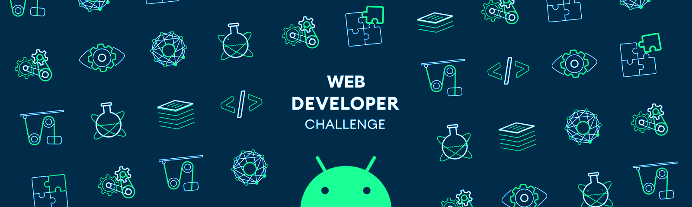

<h1 align="center">Hi 👋, I'm Vũ Lê Bảo Long</h1>
<h3 align="center">A passionate frontend developer from Viet Nam</h3>

  

-   🌱 I’m currently learning **Back End**

-   💬 Ask me about **MEARN**

-   📫 How to reach me **vulebaolong@gmail.com**

-   ⚡ Fun fact **I think I am funny**

-   📄 Curriculum Vitae: **<a href="https://drive.google.com/file/d/1kjlBbByUWDnSdj5kQHL57gK18BIuO7MO/view?usp=sharing" target="blank">EN</a>** / **<a href="https://drive.google.com/file/d/13WdHdKnUnZgW3oqoqyjTnP_RXrZNFmLS/view?usp=sharing" target="blank">VI</a>**

<h3 align="left">Connect with me:</h3>

<h3 align="left">Languages and Tools:</h3>

    
    
    
    
    
    
    
    
    
    
    
    
    
    
    
    
    
    
    
    
    

  

&nbsp;

