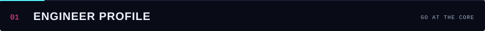
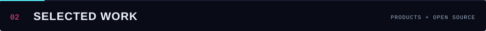
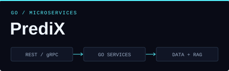
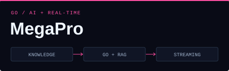
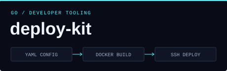
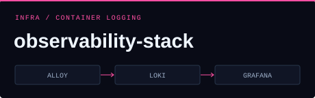
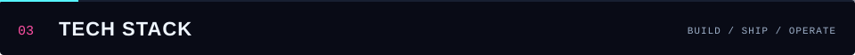
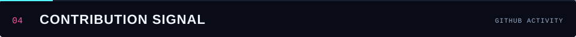
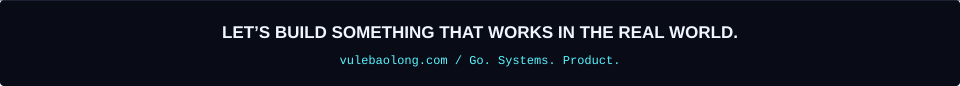

<a href="https://www.vulebaolong.com">
  <picture>
  <source media="(max-width: 600px) and (prefers-reduced-motion: reduce)" srcset="./assets/cyberpunk-banner-mobile-static.svg" />
  <source media="(prefers-reduced-motion: reduce)" srcset="./assets/cyberpunk-banner-static.svg" />
  <source media="(max-width: 600px)" srcset="./assets/cyberpunk-banner-mobile.svg" />
  
</picture>
</a>

  
  
  
  

<picture>
  <source media="(max-width: 600px)" srcset="./assets/section-about-mobile.svg" />
  
</picture>

I'm **Vu Le Bao Long**, a software engineer in **Ho Chi Minh City, Vietnam**, with **5+ years of experience** delivering software from development through production. My focus is **Go backend engineering**: APIs, microservices, real-time systems, and AI-powered products.

- **Backend:** Go services with Gin and Kratos, REST/gRPC APIs, authentication, and data workflows.
- **Real-time & AI:** streaming chat, retrieval-augmented generation, WebSocket feeds, and market data processing.
- **Delivery:** database migrations, Docker, CI/CD, deployment, and production support.
- **Across the stack:** React, Next.js, and TypeScript to bring the complete product to users.

**Open to Go Backend and Full-Stack Software Engineer opportunities.**

 

<picture>
  <source media="(max-width: 600px)" srcset="./assets/section-projects-mobile.svg" />
  
</picture>

Go-powered products first, followed by tools I build to ship and operate software.

<table>
  <tr>
    <td width="50%" valign="top">
      
      
<strong><a href="https://predixpro.io/">PrediX</a> · Go / Full-stack Engineer</strong>

      
Built Go microservices for points, referrals, battle events, and AI support, alongside customer, admin, and ambassador applications.

      <ul>
        <li>REST/gRPC APIs, reward missions, and leaderboards.</li>
        <li>OpenAI-powered RAG and streaming chat with pgvector.</li>
        <li>Database migrations, Docker, and GitHub Actions delivery.</li>
      </ul>
      
<code>Go</code> <code>Gin</code> <code>Kratos</code> <code>gRPC</code> <code>PostgreSQL</code> <code>Redis</code> <code>pgvector</code>

      
<a href="https://predixpro.io/">Visit product ↗</a>

    </td>
    <td width="50%" valign="top">
      
      
<strong><a href="https://megapro.co/">MegaPro</a> · Go / Full-stack Engineer</strong>

      
Owned Go services for an AI support assistant and real-time crypto charting, from knowledge retrieval to indicator processing.

      <ul>
        <li>Elasticsearch RAG, conversation memory, and streaming responses.</li>
        <li>WebSocket charts and custom trading indicators.</li>
        <li>Knowledge management, feedback, and production operations.</li>
      </ul>
      
<code>Go</code> <code>Gin</code> <code>Elasticsearch</code> <code>OpenAI</code> <code>MySQL</code> <code>Redis</code> <code>WebSocket</code>

      
<a href="https://megapro.co/">Visit product ↗</a>

    </td>
  </tr>
  <tr>
    <td width="50%" valign="top">
      
      
<strong><a href="https://github.com/vulebaolong/deploy-kit">deploy-kit</a> · Public repository</strong>

      
A Go CLI that reads YAML project configuration, builds Docker images, transfers them over SSH, and runs Docker Compose on the target server.

      
<code>Go</code> <code>YAML</code> <code>Docker</code> <code>SSH</code> <code>Docker Compose</code>

      
<a href="https://github.com/vulebaolong/deploy-kit">Explore source ↗</a>

    </td>
    <td width="50%" valign="top">
      
      
<strong><a href="https://github.com/vulebaolong/observability-stack">observability-stack</a> · Public repository</strong>

      
A container logging stack with Docker service discovery, Alloy log collection and relabeling, Loki storage, and Grafana for exploring logs.

      
<code>Grafana</code> <code>Loki</code> <code>Alloy</code> <code>Docker Compose</code>

      
<a href="https://github.com/vulebaolong/observability-stack">Explore source ↗</a>

    </td>
  </tr>
</table>

PrediX and MegaPro are professional work; links lead to the products. More work, including MegaTrade, CoinCraze, and Tabbicus, is on my <a href="https://www.vulebaolong.com/#work">portfolio</a>.

 

<picture>
  <source media="(max-width: 600px)" srcset="./assets/section-stack-mobile.svg" />
  
</picture>

| Layer | Technologies |
| :--- | :--- |
| **Go backend** | **Go · Gin · Kratos · Go-Zero · Ent · REST · gRPC** |
| **Data & messaging** | PostgreSQL · MySQL · MongoDB · Redis · RabbitMQ |
| **AI & real-time** | OpenAI · RAG · pgvector · Elasticsearch · WebSocket |
| **Infrastructure** | Docker · Kubernetes · GitHub Actions · AWS EC2 · Nginx |
| **Observability** | Grafana · Prometheus · Loki · Alloy |
| **Product interfaces** | TypeScript · React · Next.js · Electron · NestJS |

  
<strong>Experience & education</strong>

- **SPLabs — Software Engineer:** Go services, full-stack products, AI support systems, and real-time infrastructure for blockchain and crypto products.
- **GoFarm — Software Engineer:** employee management features, reusable interfaces, forms, validation, and backend API integrations.
- **University of Information Technology — VNUHCM (UIT):** Bachelor's degree in Information Technology.
- Full experience and certifications: [CV](https://drive.google.com/file/d/1okLI-VTKANF5FPMXldYVFYkKKGC5Fn0j/view) · [Portfolio](https://www.vulebaolong.com).

 

<picture>
  <source media="(max-width: 600px)" srcset="./assets/section-activity-mobile.svg" />
  
</picture>

Contribution calendar · refreshed daily with GitHub Actions

 

